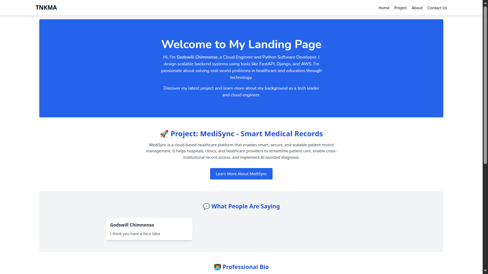

# 🌐 AltSchool Second Semester Exam – Dynamic Landing page

This project is a dynamic web application developed for the AltSchool Second Semester Exam. which features my landing page with FastAPI backend that allows users to submit feedback and contact messages. The application is deployed on an AWS EC2 instance, with Nginx serving as a reverse proxy and a CI/CD pipeline managed by GitHub Actions for automated deployments.

-----
### 🖼️ Web App Screenshot

-----

### 🚀 Live Application

You can access the live application at the following address:

**Live URL:** [**www.tnkma.com.ng**](https://www.google.com/search?q=http://www.tnkma.com.ng)

-----

## 🛠️ Tech Stack

| Category         | Technology                               |
| ---------------- | ---------------------------------------- |
| **Backend** | FastAPI, Python                          |
| **Frontend** | Jinja2, Tailwind CSS                     |
| **Database** | SQLite                                   |
| **Web Server** | Nginx, Gunicorn                          |
| **Cloud Provider**| AWS EC2 (Ubuntu)                         |
| **CI/CD** | GitHub Actions                           |
| **Email Service**| SendGrid                                 |
| **SSL/TLS** | Certbot (Let's Encrypt)                  |
| **Environment** | `python-dotenv`                          |

-----

## ⚙️ Full Deployment Workflow

This project was deployed by following a structured workflow, from server provisioning to application deployment

### 1\. EC2 Server Provisioning & Initial Setup

  - **Launched an AWS EC2 Instance:** Provisioned an Ubuntu Ec2 instance on AWS to host the application.
  - **Configured Security Groups:** Created inbound rules to allow traffic on the following ports:
      - **Port `22`:** For SSH access.
      - **Port `80`:** For HTTP traffic.
      - **Port `443`:** For HTTPS traffic.
  - **Connected to the Server:** Established a SSH connection to the EC2 instance for initial setup and configuration.

### 2\. Domain and DNS Configuration

  - **Domain Registration:** The domain `tnkma.com.ng` was bought from DomainKing.
  - **DNS Management:** Created an **A Record** in the DNS settings to point both `tnkma.com.ng` and `www.tnkma.com.ng` to the public IP address of the EC2 instance.

### 3\. Web Server and Application Deployment

  - **Nginx Installation:** Installed Nginx web server on the Ubuntu ec2 instance.
  - **Reverse Proxy Configuration:** Configured Nginx as a reverse proxy. It listens for incoming traffic on ports `80` and `443` and forwards requests to the Gunicorn server running the FastAPI application. The server block was updated with the registered domain names.
  - **Application Code Deployment:** The FastAPI application code was git cloned to the EC2 server.

### 4\. SSL/TLS Certificate for HTTPS

  - **Certbot Installation:** Installed Cerbot client to automate the process of obtaining and renewing SSL/TLS certificates from Let's Encrypt.
  - **Certificate Issuance:** Certbot was used to issue SSL certificates for both `tnkma.com.ng` and `www.tnkma.com.ng`, enabling encrypted HTTPS connections. Nginx was automatically configured by Certbot to handle SSL termination.

### 5\. CI/CD Automation with GitHub Actions

  - **Workflow Creation:** Created a GitHub Actions workflow file (`.github/workflows/main.yml`) in the project repository.
  - **Automated Deployment:** This workflow is configured to automatically connect to the EC2 server via SSH upon a `push` to the main branch. It pulls the latest code changes and restarts the Gunicorn service to ensure the application is always up-to-date.

### 6\. Application Development & Features

  - **Backend API:** Using Fastapi, developed the application to handle:
      - **Feedback Submissions:** Stores user feedback in a SQLite database.
      - **Contact Messages:** Manages and stores contact form inquiries.
      - **Email Subscriptions:** Captures and stores subscriber emails.
  - **Email Integration:** The SendGrid API was integrated to send email notifications for new feedback and messages.
  - **Frontend Development:** The user interface was built using **Jinja2** templates and styled with **Tailwind CSS**.

### 7\. Environment Variable Management

  - **Secure Credential Handling:** Used the `python-dotenv` library to manage sensitive information, such as API keys and database credentials.
  - **`.env` File:** All environment variables were stored in a `.env` file on the server, which is excluded from version control via `.gitignore` to prevent accidental exposure.

-----

## 🧪 How to Test the Application

1.  Navigate to the live URL: [**www.tnkma.com.ng**](https://www.google.com/search?q=http://www.tnkma.com.ng)
2.  Fill out the feedback form with your name, email, and a message.
3.  Click **Submit**.
4.  You can also use the contact form  to send us a message or subscribe to the newsletter.
